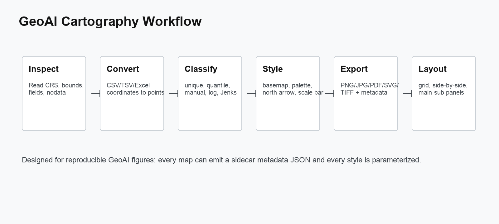
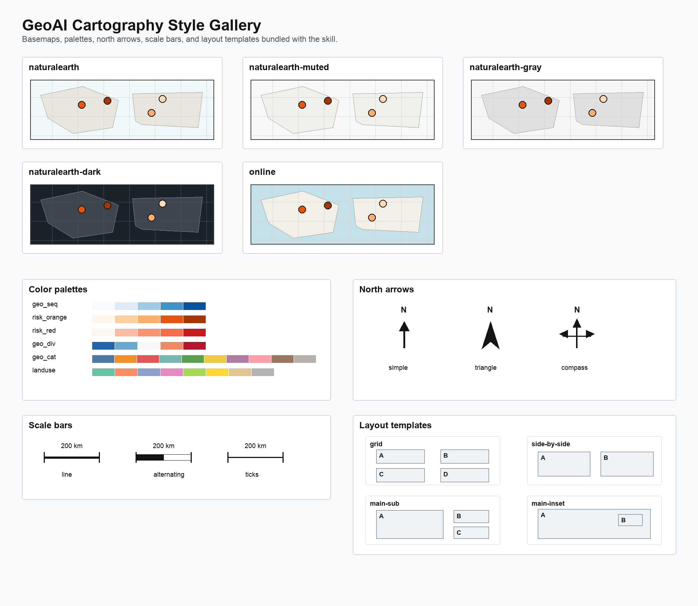

# GeoAI Cartography

`geoai-cartography` is a Codex skill for reproducible local map production in GeoAI research. It converts tabular coordinate data into point layers, renders vector and raster maps, applies publication-friendly classification and styling, and composes finished maps into multi-panel layouts.

Version: `0.1.0`

This repository can also be used outside Codex. Claude and other agents can follow `CLAUDE.md` and call the Python scripts directly.



## What It Does

- Inspect local geospatial files: CRS, bounds, fields, raster resolution, nodata, value ranges.
- Convert `.csv`, `.tsv`, `.cst`, `.xls`, and `.xlsx` files into point `.shp`, `.gpkg`, or `.geojson` layers.
- Render vector maps from `.shp`, `.gpkg`, and `.geojson`.
- Render raster maps from `.tif` and `.tiff`.
- Style maps with offline or online basemaps, palettes, legends, scale bars, north arrows, and CRS-aware projection handling.
- Classify numeric data with equal interval, quantile, Jenks/natural breaks, manual breaks, or log breaks.
- Batch-render many maps from a JSON job file.
- Compose map outputs into grid, side-by-side, and main-sub figure layouts.

## Style Gallery

The skill includes built-in basemap styles, color palettes, north arrows, scale bars, and layout templates.



## Supported Inputs and Outputs

Inputs:

- Vector: `.shp`, `.gpkg`, `.geojson`
- Raster: `.tif`, `.tiff`
- Tabular point data: `.csv`, `.tsv`, `.cst`, `.xls`, `.xlsx`

Outputs:

- Map images: `.png`, `.jpg`, `.jpeg`, `.pdf`, `.svg`, `.tif`, `.tiff`
- Converted point layers: `.shp`, `.gpkg`, `.geojson`
- Sidecar metadata: `.metadata.json`

## Quick Start

Inspect a spatial file:

```bash
python scripts/inspect_spatial_file.py data/input.shp
```

Convert a table with coordinates into a point layer:

```bash
python scripts/tabular_to_points.py data/points.tsv \
  --x Longitude \
  --y Latitude \
  --crs EPSG:4326 \
  --output outputs/points.shp
```

Render a classified point map:

```bash
python scripts/render_map.py outputs/points.shp \
  --field HEIGHT_M \
  --mode classified \
  --scheme quantile \
  --classes 5 \
  --cmap risk_orange \
  --basemap naturalearth-muted \
  --projection usa_albers \
  --north-arrow triangle \
  --scale-style alternating \
  --output outputs/height_map.jpg
```

Use online OpenStreetMap tiles:

```bash
python scripts/render_map.py outputs/points.shp \
  --field HEIGHT_M \
  --mode classified \
  --basemap online \
  --projection web_mercator \
  --tile-source OpenStreetMap.Mapnik \
  --output outputs/height_map_osm.jpg
```

## Basemaps

Offline basemaps are bundled from Natural Earth 1:110m public domain data:

- `naturalearth`
- `naturalearth-muted`
- `naturalearth-gray`
- `naturalearth-dark`

Online basemaps are available through `contextily` and `xyzservices`:

- `--basemap online`
- `--tile-source OpenStreetMap.Mapnik`
- Other `xyzservices` providers can be used when installed and available.

Online tiles require network access and must follow the provider's attribution and usage terms.

## Color Palettes

Built-in palette aliases live in `assets/palettes.json`.

Sequential:

- `geo_seq`
- `water`
- `terrain_soft`
- `risk_orange`
- `risk_red`
- `green`

Diverging:

- `geo_div`
- `residual`
- `change`

Categorical:

- `geo_cat`
- `landuse`

You can also use any Matplotlib colormap name, such as `viridis`, `cividis`, `YlGnBu`, `YlOrRd`, `RdBu_r`, `Set2`, or `tab20`.

## Classification

Supported schemes:

- `equal_interval`
- `quantile`
- `natural_breaks`
- `jenks`
- `log`
- `manual`

Manual breaks:

```bash
python scripts/render_map.py input.shp \
  --field value \
  --mode classified \
  --scheme manual \
  --breaks "0,0.1,0.5,1,5,10" \
  --output manual_breaks.jpg
```

Log breaks:

```bash
python scripts/render_map.py input.shp \
  --field population \
  --mode classified \
  --scheme log \
  --classes 6 \
  --output log_classes.jpg
```

## Projections

Use `--projection` for common aliases or `--target-crs` for any custom EPSG/PROJ CRS string.

Common aliases:

- `auto_utm`, `local_utm`
- `web_mercator`
- `plate_carree`, `wgs84`
- `equal_earth`, `robinson`, `mollweide`
- `world_mercator`, `world_cylindrical_equal_area`
- `north_polar_stereo`, `south_polar_stereo`
- `usa_albers`, `conus_albers`
- `europe_laea`
- `china_albers`
- `asia_lambert`
- `keep`

Example:

```bash
python scripts/render_map.py input.shp \
  --field value \
  --mode classified \
  --projection china_albers \
  --output china_albers.jpg
```

## North Arrows and Scale Bars

North arrow styles:

- `simple`
- `triangle`
- `compass`
- `none`

Scale bar styles:

- `line`
- `alternating`
- `ticks`
- `none`

Example:

```bash
python scripts/render_map.py input.shp \
  --field value \
  --mode classified \
  --north-arrow compass \
  --scale-style alternating \
  --output styled_map.jpg
```

## Batch Rendering

Batch jobs are defined in JSON:

```bash
python scripts/batch_render.py examples/batch_render.example.json
```

Each job maps directly to `render_map.py` arguments:

```json
{
  "jobs": [
    {
      "input": "points.shp",
      "output": "height_quantile.jpg",
      "field": "HEIGHT_M",
      "mode": "classified",
      "scheme": "quantile",
      "classes": 5,
      "cmap": "risk_orange",
      "basemap": "naturalearth-muted",
      "projection": "usa_albers"
    }
  ]
}
```

## Layout Composition

Compose rendered map images into figure layouts:

```bash
python scripts/compose_layout.py \
  --images map_a.jpg map_b.jpg \
  --layout side-by-side \
  --labels A B \
  --title "Basemap comparison" \
  --output comparison.jpg
```

Supported layouts:

- `grid`
- `side-by-side`
- `main-sub`

The style reference also describes `main-inset` as a planned layout pattern for map-level inset rendering.

## Dependencies

Core:

```bash
pip install pandas numpy pillow
```

Full GIS rendering:

```bash
pip install geopandas rasterio matplotlib pyproj shapely mapclassify
```

Excel and online basemaps:

```bash
pip install openpyxl contextily xyzservices
```

## Notes

- Natural Earth basemap data is public domain.
- Online tiles require attribution and network access.
- For area-based choropleths, prefer equal-area projections.
- For regional point maps and reliable scale bars, prefer `auto_utm` or a local projected CRS.
- For online tile basemaps, prefer `web_mercator`.

## License

Code in this repository is released under the MIT License. Bundled Natural Earth basemap data is public domain.
